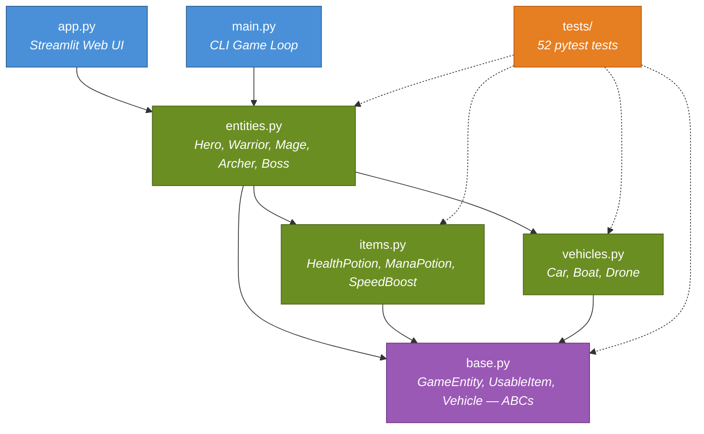

# Module Architecture — Dependency Graph

> **Tool**: Mermaid `graph TD`
> **Purpose**: Shows how all Python modules import and depend on each other. This is the "big picture" of the project structure.

## How to Read This

- Arrows point **from importer → imported** (e.g. `entities.py → base.py` means entities imports from base)
- The two entry points (`app.py` and `main.py`) sit at the top
- Abstract base classes (`base.py`) sit at the bottom — everything depends on them
- `tests/` imports all game modules but is not imported by anything

## Diagram

## Key Takeaways

1. **`base.py` is the foundation** — all game logic depends on its ABCs
2. **`entities.py` is the central hub** — it imports from all three base modules
3. **`items.py` and `vehicles.py` are independent** — they only depend on `base.py`, not on each other
4. **`app.py` and `main.py` are interchangeable UIs** — both depend only on `entities.py`
5. **Separation of concerns** — UI layer → game logic layer → abstract base layer
