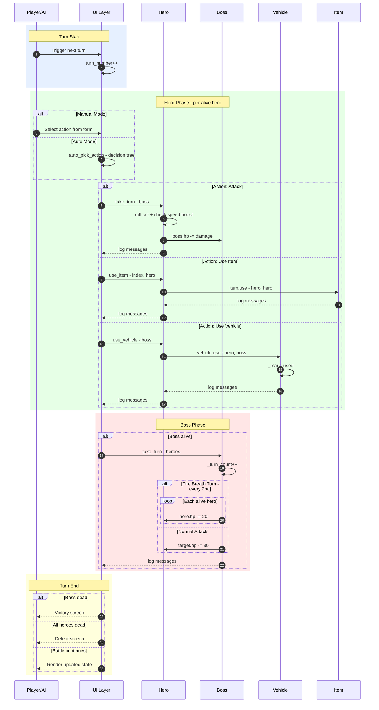

# Battle Turn Sequence — Sequence Diagram (Mermaid Backup)

> **Tool**: Mermaid `sequenceDiagram`
> **Purpose**: Mermaid version of the PlantUML sequence diagram. Simplified to fit Mermaid's capabilities.

## Diagram

## Notes

- Mermaid sequence diagrams lack the detailed note formatting and autonumber features of PlantUML
- The `alt`/`loop` blocks work but are less visually distinct
- For the most detailed sequence diagram, prefer the [PlantUML version](diagram-battle-turn-sequence.md)
