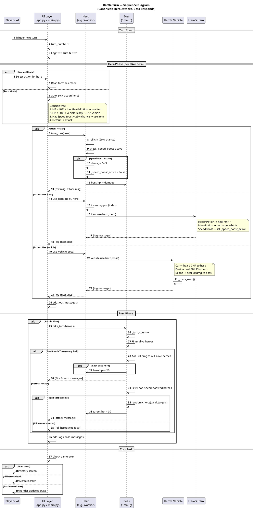
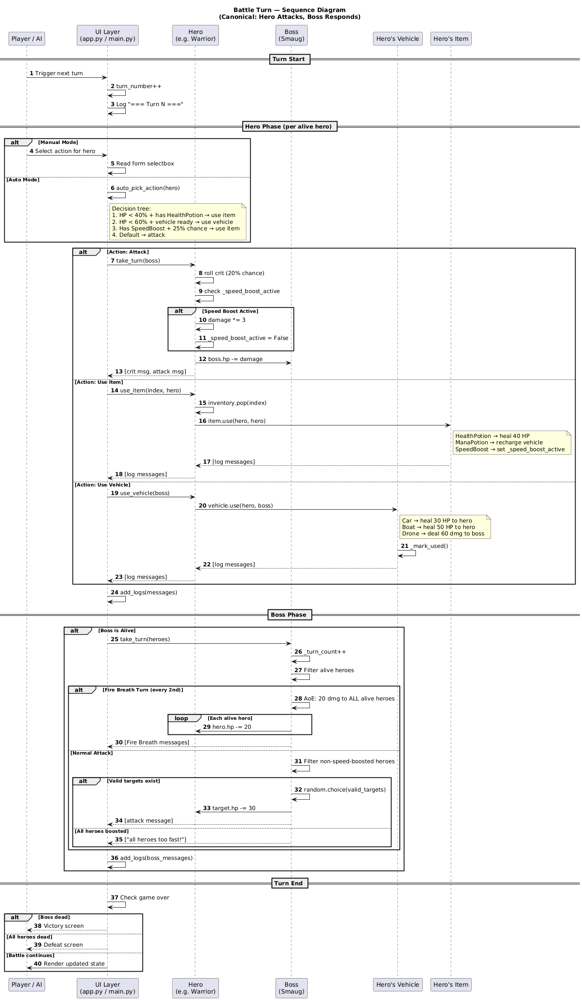

# Battle Turn Sequence — Sequence Diagram

> **Tool**: PlantUML
> **Purpose**: Shows the method call chain and message flow during a single canonical battle turn. Demonstrates how objects interact at runtime.

## How to Read This

- **Participants** (top boxes) = the objects involved
- **Solid arrows** = method calls
- **Dashed arrows** = return values
- **`alt`/`opt`/`loop` blocks** = conditional branches
- This diagram shows a canonical turn: one hero attacks, then boss responds

## Diagram

## Key Interactions

| From | To | Method | Returns |
|------|----|--------|---------|
| UI | Hero | `take_turn(boss)` | `list[str]` — log messages |
| UI | Hero | `use_item(index, hero)` | `list[str]` — log messages |
| UI | Hero | `use_vehicle(boss)` | `list[str]` — log messages |
| UI | Boss | `take_turn(heroes)` | `list[str]` — log messages |
| Hero | Item | `item.use(hero, hero)` | `list[str]` — log messages |
| Hero | Vehicle | `vehicle.use(hero, boss)` | `list[str]` — log messages |

## Design Pattern: `list[str]` Return

Every game logic method returns `list[str]` instead of calling `print()` directly. This is the **Separation of Concerns** pattern:

- **Game logic** (entities, items, vehicles) produces messages
- **UI layer** (app.py, main.py) decides how to display them
- Same logic works in both Streamlit and CLI
