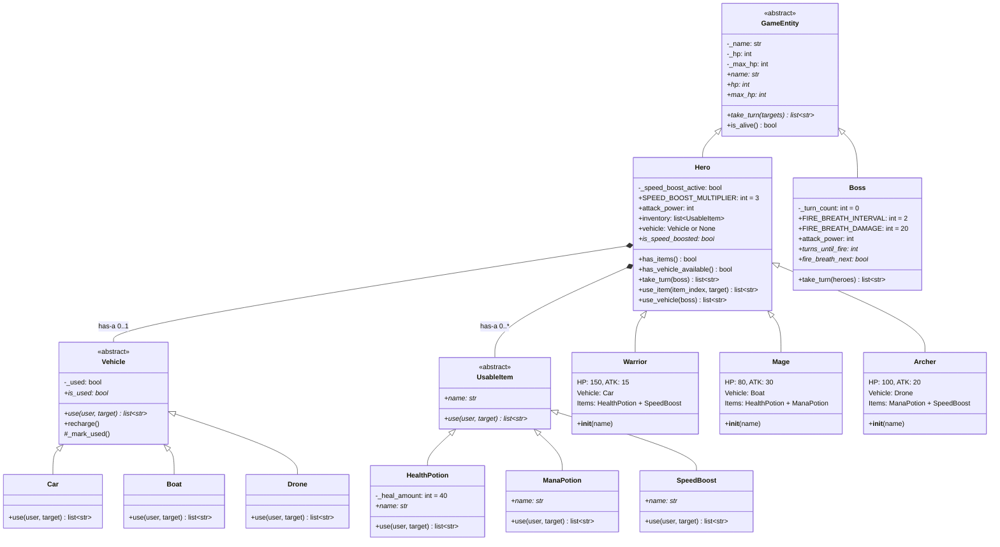

# Class Hierarchy — UML Class Diagram (Mermaid Backup)

> **Tool**: Mermaid `classDiagram`
> **Purpose**: Mermaid version of the PlantUML class diagram. Slightly less detailed but renders natively in VS Code with the Mermaid extension.

## Diagram

## Notes

- This Mermaid version lacks the `«abstract»` stereotype rendering and method-level visibility icons that PlantUML provides
- Composition arrows (`*--`) are supported but cardinality labels are less precise
- For the most detailed UML representation, prefer the [PlantUML version](diagram-class-hierarchy.md)
