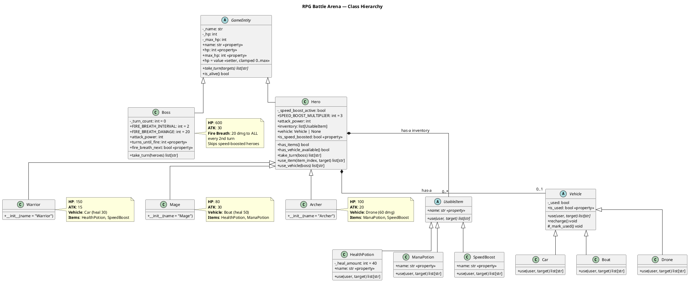
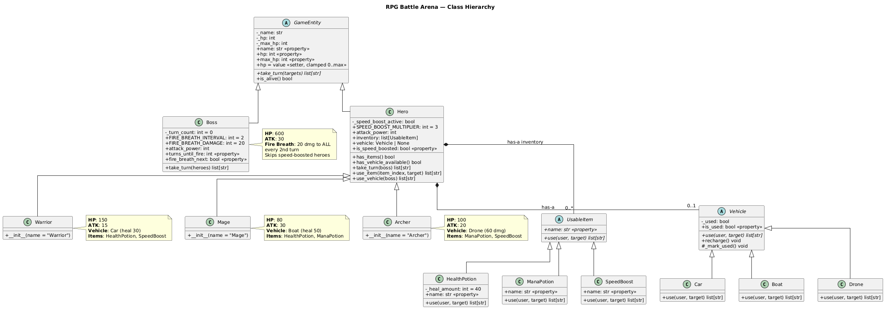

# Class Hierarchy — UML Class Diagram

> **Tool**: PlantUML
> **Purpose**: Full UML class diagram showing all classes, their attributes, methods, inheritance (extends), and composition (has-a) relationships.

## How to Read This

- **Dashed arrows** (`..|>`) = inheritance (extends / "is-a")
- **Solid diamonds** (`*--`) = composition ("has-a", owned part)
- **«abstract»** = abstract base class, cannot be instantiated
- **`+`** = public, **`-`** = private, **`#`** = protected
- **Italic methods** = abstract methods (must be overridden)

## Diagram

## OOP Concepts Demonstrated

| Concept | Where to See It |
|---------|----------------|
| **Inheritance** | `Hero` and `Boss` extend `GameEntity`; `Warrior/Mage/Archer` extend `Hero` |
| **Abstract Base Class** | `GameEntity`, `UsableItem`, `Vehicle` define interfaces that subclasses must implement |
| **Composition** | `Hero` *has-a* `Vehicle` (0..1) and *has-a* inventory of `UsableItem` (0..*) |
| **Polymorphism** | All items share `.use()` interface but behave differently; all vehicles share `.use()` interface |
| **Encapsulation** | Private attributes (`_hp`, `_used`, `_speed_boost_active`) with public property getters |
| **Class Constants** | `SPEED_BOOST_MULTIPLIER`, `FIRE_BREATH_INTERVAL`, `FIRE_BREATH_DAMAGE` |
