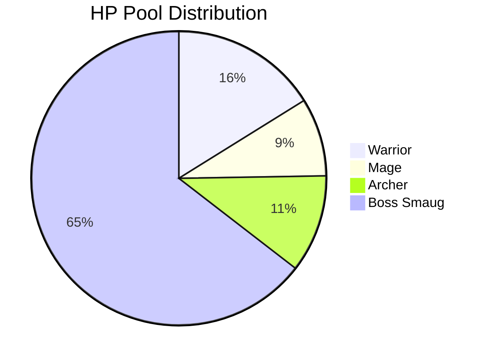
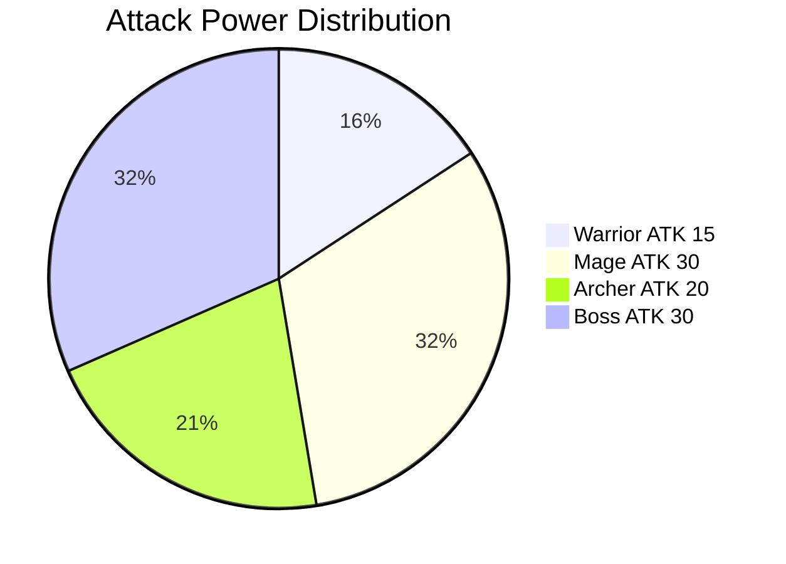
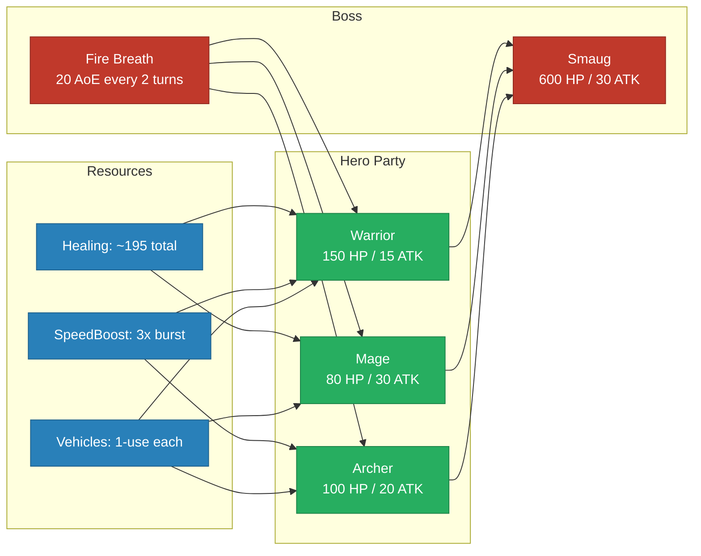

# Game Balance — Hero vs Boss Stats (Mermaid Backup)

> **Tool**: Mermaid
> **Purpose**: Mermaid version of the game balance comparison. Uses a combination of `pie` chart and `graph` for visual comparison.

## Diagram 1: HP Pool Comparison

## Diagram 2: Attack Power Comparison

## Stat Comparison Table

| Unit | HP | ATK | Vehicle Effect | Items |
|------|----|----|---------------|-------|
| **Warrior** | 150 `██████████░░░░░░░░░░` | 15 `██░░░░░░░░` | Car: heal 30 | HealthPotion, SpeedBoost |
| **Mage** | 80 `█████░░░░░░░░░░░░░░░` | 30 `████░░░░░░` | Boat: heal 50 | HealthPotion, ManaPotion |
| **Archer** | 100 `██████░░░░░░░░░░░░░░` | 20 `███░░░░░░░` | Drone: 60 dmg | ManaPotion, SpeedBoost |
| **Boss** | 600 `████████████████████` | 30 `████░░░░░░` | — | Fire Breath: 20 AoE / 2 turns |

## Balance Summary

## Notes

- Mermaid `pie` charts are simple but effective for proportional comparison
- The `graph` provides a visual network of how resources flow
- The Unicode bar table provides exact numbers at a glance
- For the full Ditaa infographic version, see [diagram-game-balance.md](diagram-game-balance.md)
