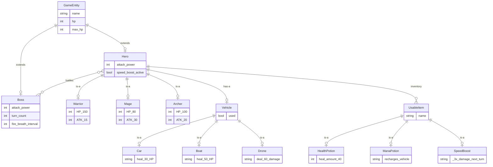

# Game Object Model — ERD (Mermaid Backup)

> **Tool**: Mermaid `erDiagram`
> **Purpose**: Mermaid version of the entity-relationship diagram. Focuses on how game objects connect to each other.

## Diagram

## Notes

- Mermaid ERD doesn't support the `0..1` cardinality notation as precisely as Kroki ERD
- Entity attributes in Mermaid ERD are simpler — they don't support type annotations
- For the most precise ERD, prefer the [Kroki ERD version](diagram-game-object-model.md)
