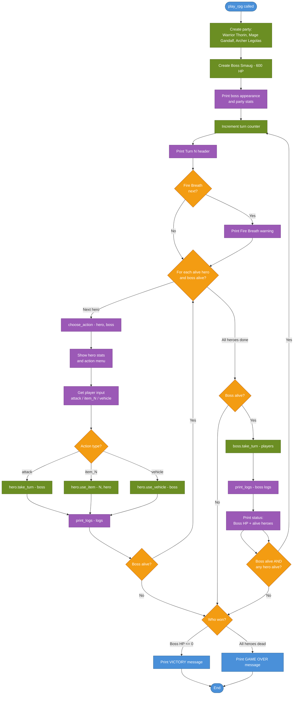

# Main.py Flow — CLI Game Loop

> **Tool**: Mermaid `flowchart TD`
> **Purpose**: Shows the CLI game loop flow — a classic imperative turn-based game loop.

## How to Read This

This is a straightforward top-to-bottom game loop. Unlike the Streamlit version (`app.py`), this is a traditional `while` loop with sequential I/O.

## Diagram

## Key Differences from `app.py`

| Aspect | `main.py` CLI | `app.py` Streamlit |
|--------|--------------|-------------------|
| Loop model | `while` loop — runs continuously | Reactive — reruns on interaction |
| Action selection | Sequential per-hero `input()` prompts | Batch form (Manual) or AI (Auto) |
| Display | `print()` to stdout | `st.text_area` battle log |
| State | Local variables in function | `st.session_state` |
| Boss turn | Inline after hero loop | Same, but inside a rerun |
