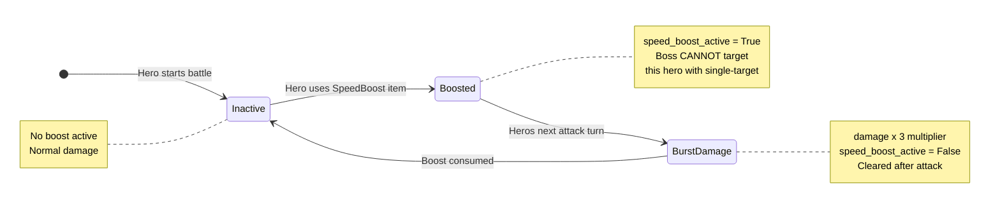

# SpeedBoost Mechanic — State Diagram

> **Tool**: Mermaid `stateDiagram-v2`
> **Purpose**: Shows the SpeedBoost state transitions across turns. This is the most complex mechanic in the game and benefits from a dedicated state diagram.

## How to Read This

- Each box is a **state** the hero can be in regarding SpeedBoost
- Arrows show **transitions** triggered by game events
- The `[*]` symbol marks the initial/default state
- Dotted lines separate the three phases: Item Use → Immune → Burst

## Diagram

## Detailed Walkthrough

### Turn N — Hero Uses SpeedBoost

1. Hero selects SpeedBoost from inventory
2. `SpeedBoost.use()` sets `hero._speed_boost_active = True`
3. Item is removed from inventory (consumed)
4. Hero enters **Immune** state

### Turn N — Boss Phase

1. Boss selects single-target attack target
2. Boss filters out heroes where `is_speed_boosted == True`
3. If ALL alive heroes are boosted → boss wastes its turn
4. Fire Breath **still hits** boosted heroes (AoE ignores immunity)

### Turn N+1 — Hero Attack Phase

1. Hero attacks (forced — no other action clears the boost)
2. `hero.take_turn()` checks `_speed_boost_active`
3. Damage is multiplied by `SPEED_BOOST_MULTIPLIER` (3x)
4. `_speed_boost_active` is set to `False`
5. Crit + SpeedBoost = `attack_power × 2 × 3 = 6x` damage (rare but devastating)

### Edge Cases

| Scenario | What Happens |
|----------|-------------|
| All heroes use SpeedBoost same turn | Boss cannot single-target anyone, wastes turn. Fire Breath still hits all. |
| Hero uses SpeedBoost then dies to Fire Breath | Boost is lost — hero is dead |
| SpeedBoost + Crit on same attack | 6x damage (2x crit × 3x boost) |
| ManaPotion recharges SpeedBoost? | No — ManaPotion recharges **Vehicle**, not items. Items are one-time use. |
